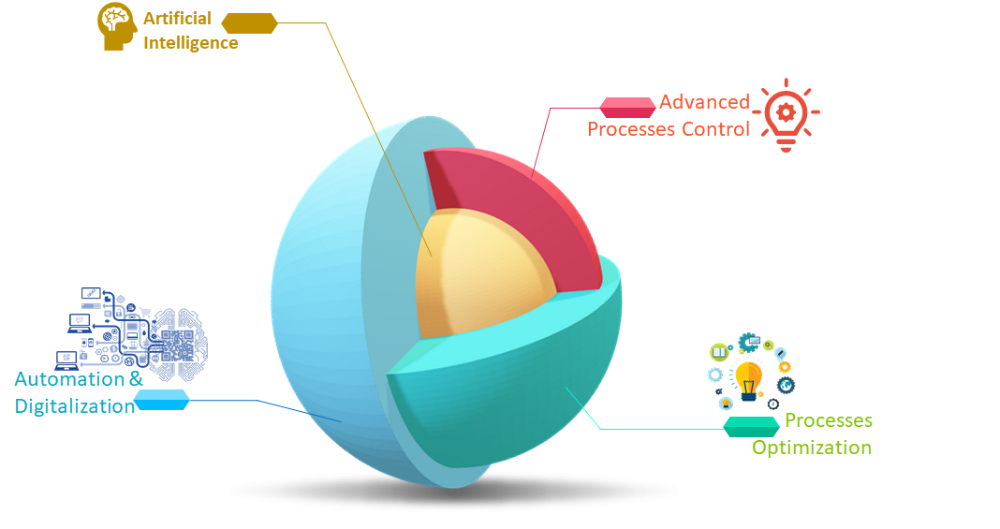

 

    Since the beginning of my career, I have followed the tendency of what was to be called Industry 4.0. At that time, I realized that the traditional approach to chemical engineering would need a new standpoint for that emerging industrial revolution. Hence, I searched for what could be developed to provide practical solutions to meet those new industrial paradigms. I found that Artificial Intelligence (AI) would be essential. Therefore, I started to focus my research on transporting the new AI concept to chemical engineering. Over the last few years, my research efforts have been dedicated to developing novel and innovative AI-based solutions in chemical processes, especially their integration with process optimization, control, monitoring, and process automation. More recently, I added a new level in my research scope: the concise integration of these elements within cognitive Cyber-physical systems. Overall, I list my research in five main branches:
  
  
  
- **Artificial Intelligence** aims to develop AI solutions to solve complex chemical processes issues, such as simulation, prediction, soft sensors, and fault detection, thus providing a reliable source of real-time information. Furthermore, it focuses on developing and employing cutting-edge supervised and unsupervised solutions to promote autonomy and self-management abilities in chemical plants. This branch also focuses on developing a hybrid model, harnessing the potentialities of AI and the robustness of first principle models.
- **Advanced Process Control** covers the development of controllers with guaranteed stability and stable integration with the Real-time Optimization (RTO) layer for complex chemical processes. Model uncertainty is included using robust formulations. Furthermore, these controllers are developed to accommodate AI models to improve their performance.
-  **Processes Optimization** concerns the development of solutions for real-time economic optimization of cyclic adsorption separation processes. The focus is to develop a methodology for implementing RTO formulations (single or multi-objective) for complex chemical processes based on AI surrogate models, coupled with industrial units' safety, economic, and environmental constraints.
- **Processes Automation and Digitalization** regard developing solutions for automation of chemical units to promote the integration between the other branches of my research and the physical processes. It focuses on consolidating concise cyber-physical systems and exploring their potentialities through their cloning into digital twins. This branch serves as a backbone to support the integration of my research with its application domain.
- **Experimental Developments** covers the practical issues related to chemical processes to develop simplified uncertainty-based experimental procedures. It aims at the determination of a trustworthy, reliable, and precise model. It considers the uncertainty evaluation a critical tool that allows the model identification and validation with a few experiments while leading to high precision predictions. This provides a robust basis for the developments of the other branches.

  
