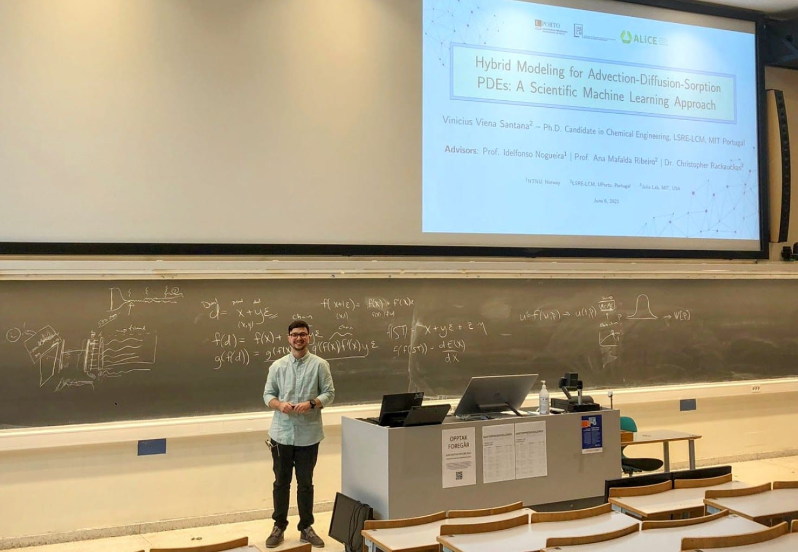
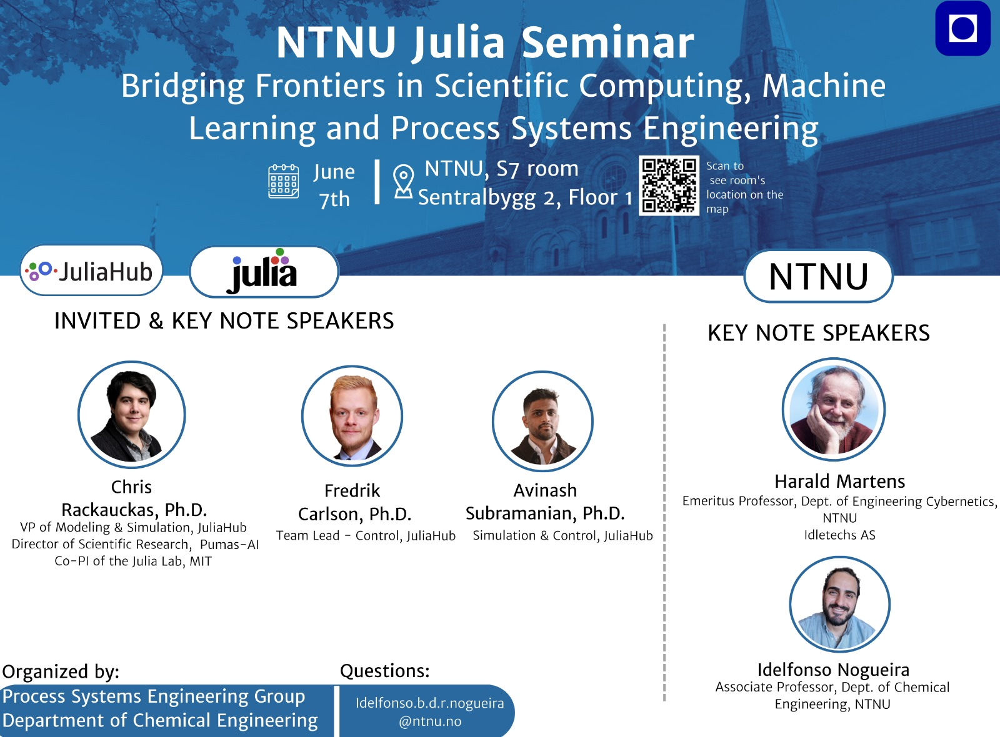
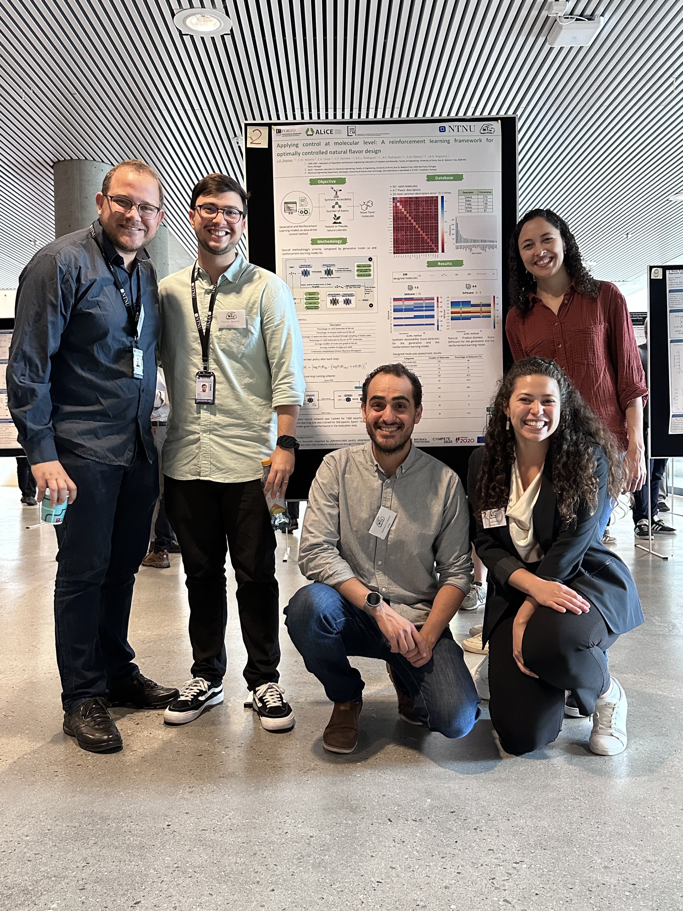
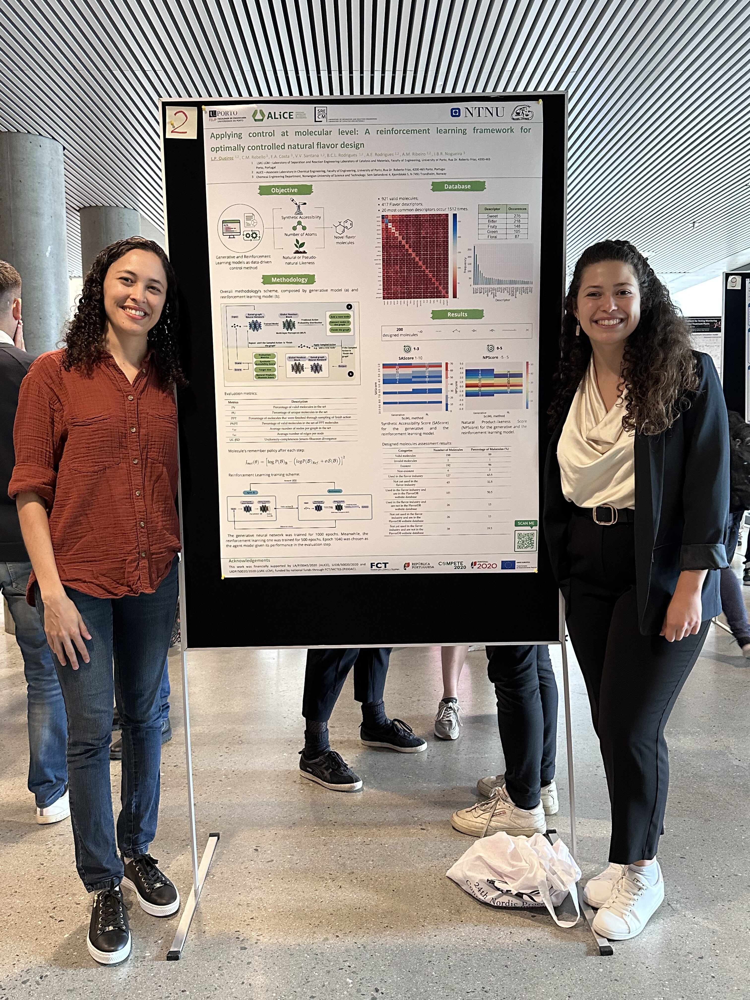
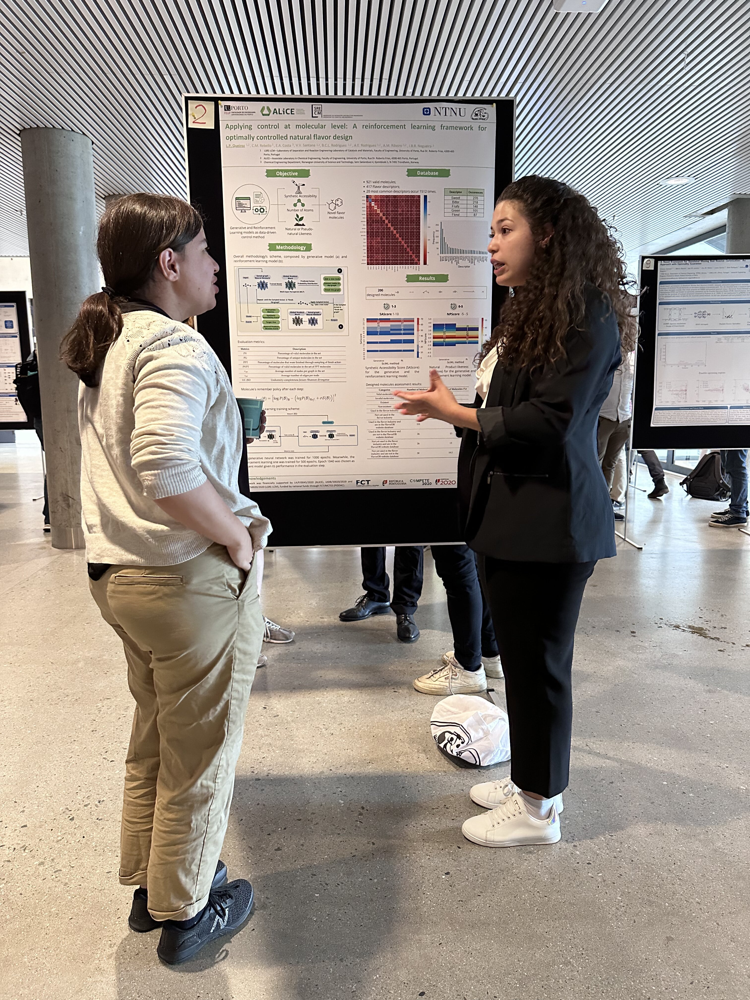
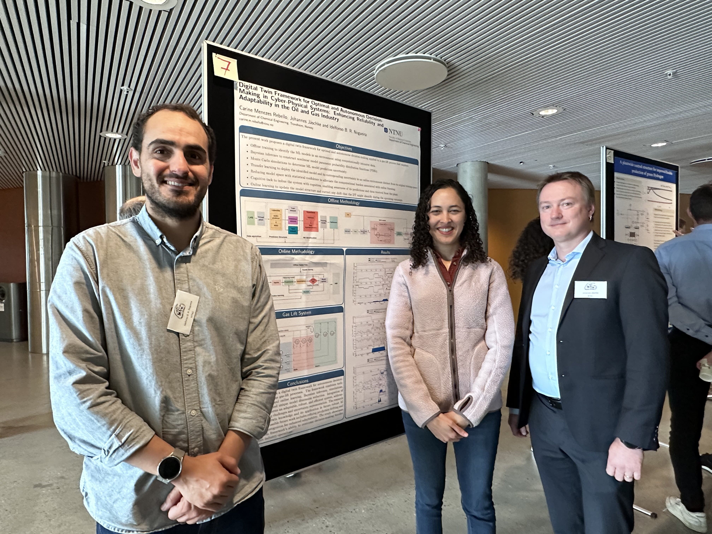
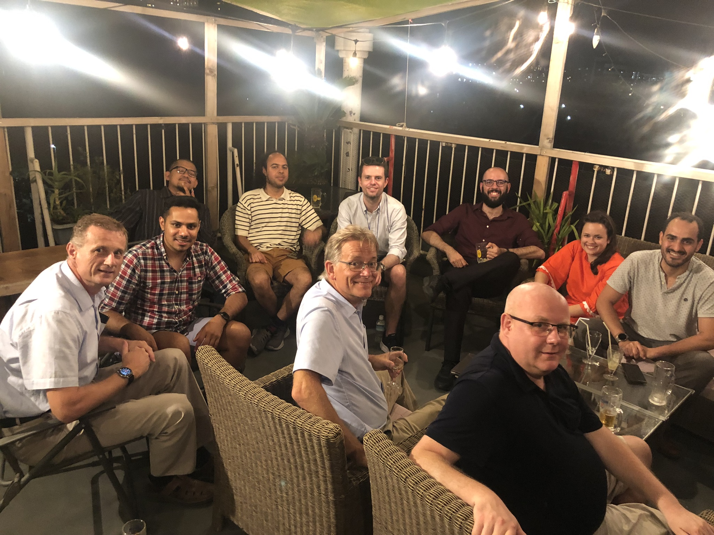
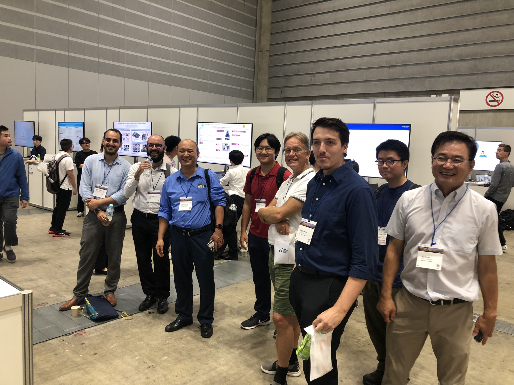
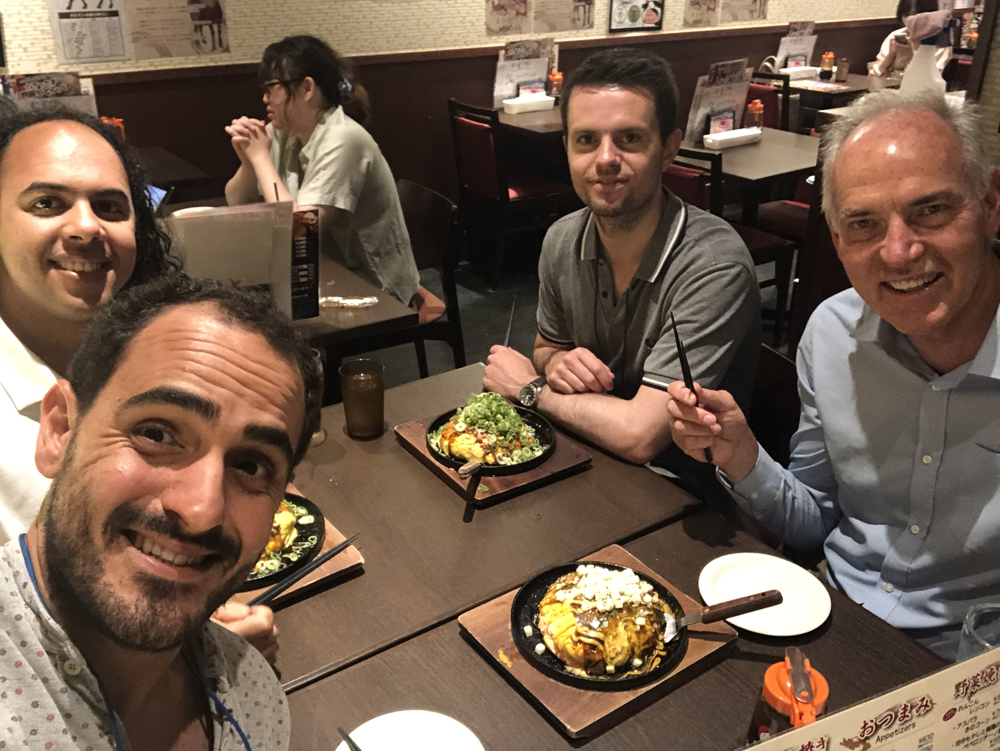

## NTNU Julia Seminar - August 2023

<left></left>
<right></right>

  

    
    
  

## NTNU Process Control Congress - August 2023

  

    
    
  

  

    
    
  

## IFAC World Congress in Yokohama, Japan - July 2023

  

    
    
  

  

    
    
  

